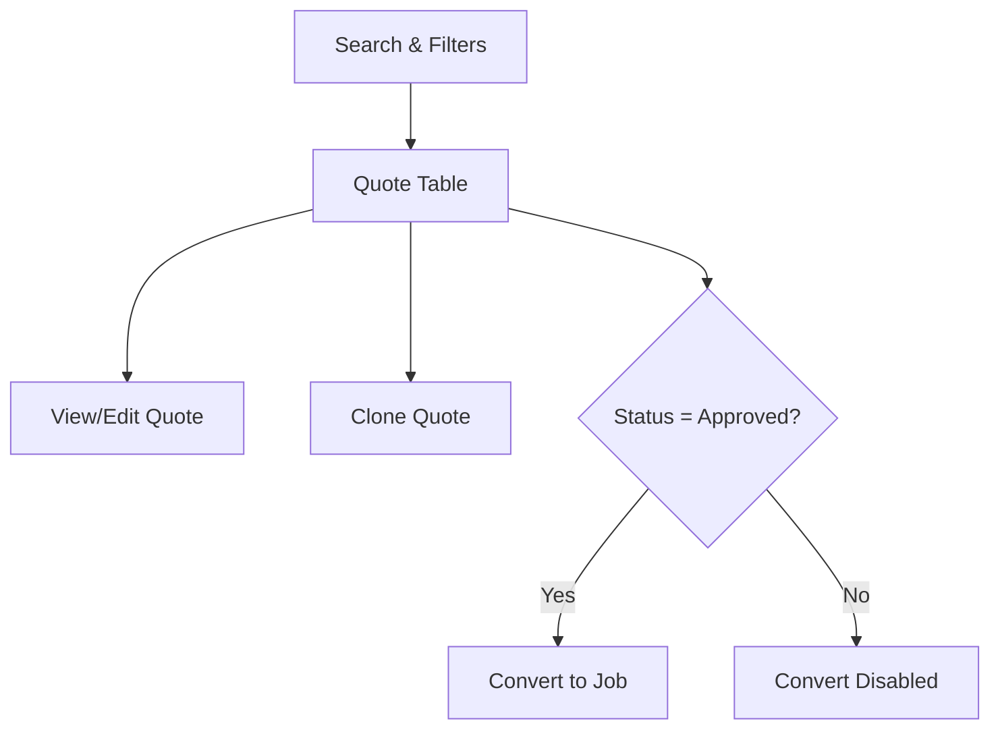
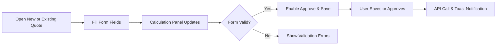

# Client Quoting Module UI/UX Mockups

## Quote List View

**Header**
- Title: “Quotes” aligned left.
- Primary action button: **New Quote** (top-right, primary color).
- Secondary actions: **Bulk Actions** dropdown (Export, Delete).

**Search & Filter Bar**
- Search input (placeholder “Search by quote #, client name…”).
- Filters:
  - Status dropdown (All, Draft, Pending Approval, Approved, Expired).
  - Client autocomplete selector.
  - Date range picker (Created date).
- “Apply Filters” button and “Clear All” link.

**Quote Table**
|   | Quote # | Status                 | Client     | Created       | Expires       | Total Value | Actions                         |
|---|---------|------------------------|------------|---------------|---------------|-------------|---------------------------------|
| ☑ | 12345   |  Approved   | Acme Co    | 2025-07-01    | 2025-07-31    | $12,500     | ✏️ View/Edit  📋 Clone  🧳 Convert |
|   | ...     | ...                    | ...        | ...           | ...           | ...         | ...                             |

- Row hover highlight; click anywhere opens detail.
- Status badges colored: Draft (gray), Pending (blue), Approved (green), Expired (red).

**Pagination & Page Size**
- Rows per page selector (10, 25, 50, 100).
- Pagination controls: « < 1 2 3 > » .

**Notifications & Alerts**
- Inline alerts above table:
  - “3 quotes expired today” with link to filter Expired.
- Toast on actions: “Quote cloned successfully”.

**User Flow Diagram**

---

## Quote Detail/Create View

**Header**
- Breadcrumb: Quotes / [Quote #123] or New Quote.
- Title: “Quote #123” or “New Quote”.
- Actions:  
  - **Save Draft** (primary gray).  
  - **Approve Quote** (primary green; disabled until form valid).  
  - **Clone** (secondary).  
  - **Cancel** (link).

**Form Layout**
- Two-column grid:
  - **Left Column** (Form fields):
    1. Client (autocomplete).
    2. Service Type (dropdown).
    3. Pricing Tier (dropdown).
    4. Estimated Tonnes (number input).
    5. Expiration Date (date picker).
    6. Notes (textarea).
  - **Right Column** (Real-Time Calculation Panel):
    - Unit Rate: $ XX.XX.
    - Estimated Total: $ Tonnes × Rate.
    - Tier Discount: – $ YY.YY.
    - Final Total: $ ZZ.ZZ.
    - Expiry Countdown: “Expires in 30 days”.

- Inline validation: required fields highlight in red with message.

**Clone Behavior**
- Clicking Clone duplicates all field values into a new draft; header title changes to New Quote (Cloned).

**User Flow Diagram**

**Interactions**
1. User selects client and service → pricing and tiers load.
2. User enters tonnes → real-time total updates.
3. User adds notes → optional.
4. Click **Save Draft** → draft saved, toast “Draft saved”.
5. Click **Approve Quote** → confirmation modal, then status changes to Approved.
6. Click **Clone** → opens new form populated, status = Draft.
